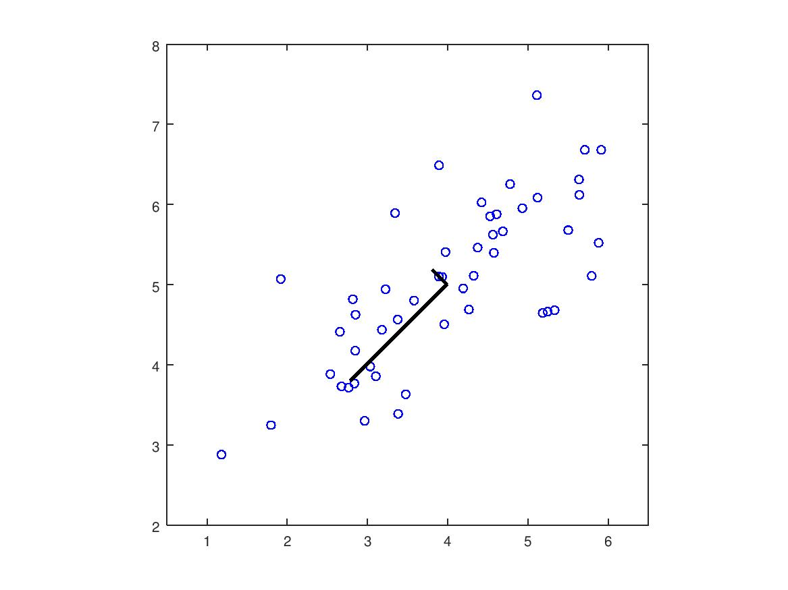
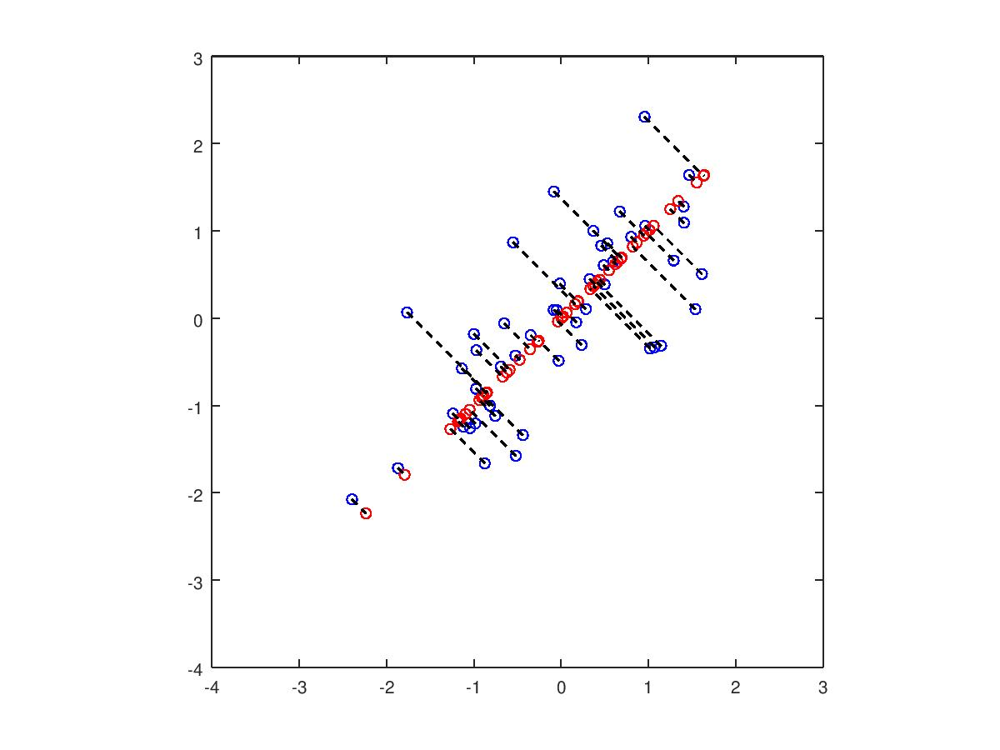
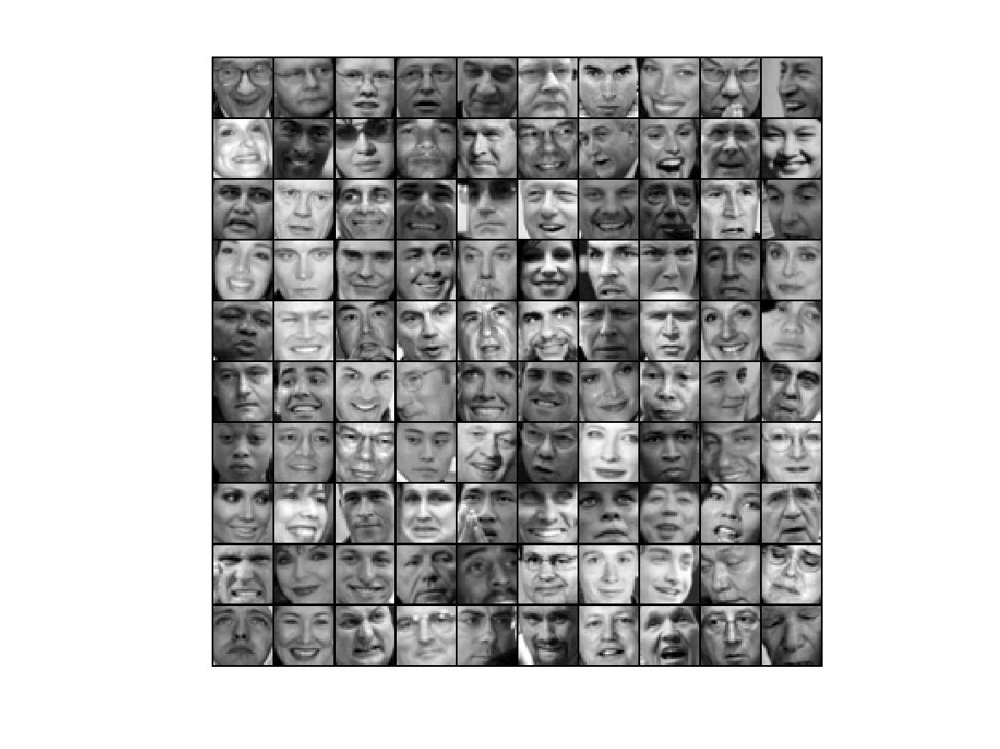
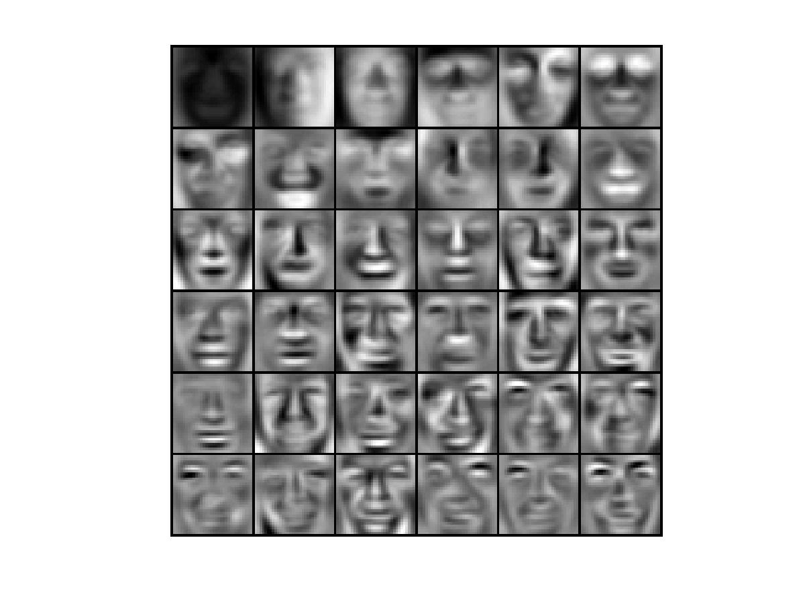
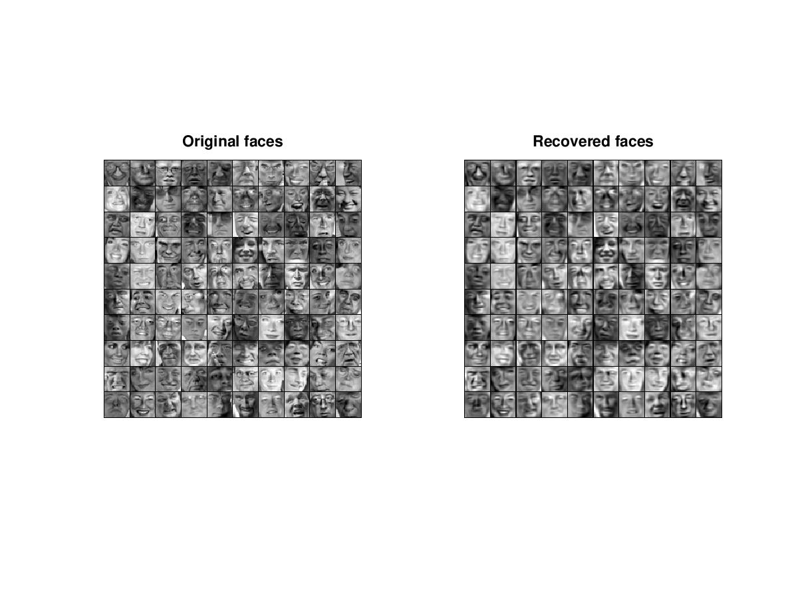

# dimensionality-reduction
We use principal component analysis (PCA) to perform dimensionality reduction.

## Table of Contents
* [Example Dataset](#example-dataset)
* [Implementing PCA](#implementing-pca)
* [Dimensionality Reduction](#dimensionality-reduction)
  * [Projecting the data onto the principal components](#projecting-the-data-onto-the-principal-components)
  * [Reconstructing an approximation of the data](#reconstructing-an-approximation-of-the-data)
  * [Visualizing the projections](#visualizing-the-projections)
* [Face Image Dataset](#face-image-dataset)
  * [PCA on Faces](#pca-on-faces)
  * [Dimensionality Reduction on Faces](#dimensionality-reduction-on-faces)
* [To-Do List](#to\-do-list)

## Example Dataset
To understand how PCA works, we start first start with a 2D dataset which which has
one direction of large variation and one of smaller variation. The script file **tests/ExampleDataset.m**
will plot the training data 


We will visualize what happen when we use
PCA to reduce the data from 2D to 1D. In practice. we want
to reduce data from say 256 to 50 dimensions; however, using lower dimensional data makes it easier 
for us to visualize the algorithms.

## Implementing PCA
PCA consists of two computational steps: First, compute the covariance matrix of the data.
Then, you use Octave's SVD function to compute the eigenvectors *U<sub>1</sub>*,
*U<sub>2</sub>*,...,*U<sub>n</sub>*. These will correspond to the principal
components of variation in the data.
Before using PCA, it is important to first normalize the data by subtracting
the mean value of each feature from the dataset, and scaling each dimension so
that they are in the same range. We perform normalization using **src/featureNormalize.m**
After normalizing the data, we can run PCA to compute the principal components.
**src/pca.m** computes the principal components of the dataset, which first computes
the covariance matrix of the data, given by:

*M = 1/m(X<sup>T</sup>X)*

where *X* is the data matrix with examples in rows, and *m* is the number
of examples. Note that *M* is a *n x n* matrix.
After computing the covariance matrix, we run SVD to compute principal components.
In Octave, SVD runs from the following command: 
```Octave
[U, S, V] = svd(Sigma)
```
where *U* will contain the principal components and *S* will contain a diagonal matrix.



**tests/PCA.m** runs PCA on the example dataset and plot the corresponding principal components
(*see figure above*). This script also outputs the top principal component (eigenvectors)
found, and has an expected output of
```Octave
[-0.707,-0.707]
```
(It is possible that Octave may instead output of negative of this, since *U<sub>1</sub>*
and *-U<sub>1</sub>* are equally valid choices for the first principal component.)

## Dimensionality Reduction
After computing the principal components, we can use them to reduce the feature 
dimension of our dataset by projecting each example onto a lower dimensional space,
*x<sup>(i)</sup> -> z<sup>(i)</sup>*. 
In practice, the projected data could be used instead of the original data 
for a learning algorithm. 

### Projecting the data onto the principal components
The function in **src/projectData.m** returns new dataset given a dataset *X*,
the principal components *U*, and the desired number dimensions to reduce to *K*.

### Reconstructing an approximation of the data
The function in **src/recoverData.m** projects each example in *Z* back onto the original
space and returns the recovered approximation.

### Visualizing the projections
The script in **tests/visualizeProjection.m** shows how the projection affects the data.

The red circles indicate the projected data points and the dotted lines connect the original,
normalized dataset to the projected ones.

## Face Image Dataset
We now apply PCA to a real data set. **data/faces.mat** contains a dataset *X* of face images,
each 32 x 32 in grayscale. Each row of *X* corresponds to one face image (a row vector of length
32 x 32 = 1024). (drawn below)


### PCA on Faces
The script in **tests/pcaFaces.m** will normalize the data matrix *X* and store the principal component
in *U*. It will then display the first 36 principal components that describes the largest variations.


### Dimensionality Reduction on Faces
We then project the face dataset using just the first 100 prinicpal components. When we recover the dataset
we can compare the data side by side


## PCA for visualization
Visualizing datasets in 3 dimensions or greater can be cumbersome. Therefore, we would want to display
the data in 2D even at the cost of losing some information. In practice, PCA can reduce the dimensionality
of data for visualization purposes. The script in **tests/pcaVisualization.m** will aply PCA to
a 3-dimensional data to reduce it to 2 dimensions and visualize the result in a 2D scatter plot. It
can be thought of as a rotation that selects the best view that maximizes the spread of the data.
(Figure of data in 3D to be added later)
(Figure of data in 2D to be added later)

## To-Do List
- [X] implement tests/ExampleDataset.m
- [X] create figure for Example Dataset
- [X] implement PCA
  - [X] implement src/featureNormalize.m
  - [X] implement src/pca.m
  - [X] implement tests/PCA.m
  - [X] create figure for PCA
- [X] implement dimensionality reduction
  - [X] project data onto principal components
  - [X] reconstruct data 
  - [X] visualization of the projection
  - [X] add figure for projection visualization
- [X] PCA on Faces
  - [X] add data/faces.mat
  - [X] add figure for face data
  - [X] implement tests/pcaFaces.m
  - [X] add figure for principal components on the face
  - [X] add figure for side by side data comparison
- [ ] PCA for visualization
  - [ ] add 3D data plot
  - [ ] implement tests/pcaVisualization.m
  - [ ] add 2D data plot
